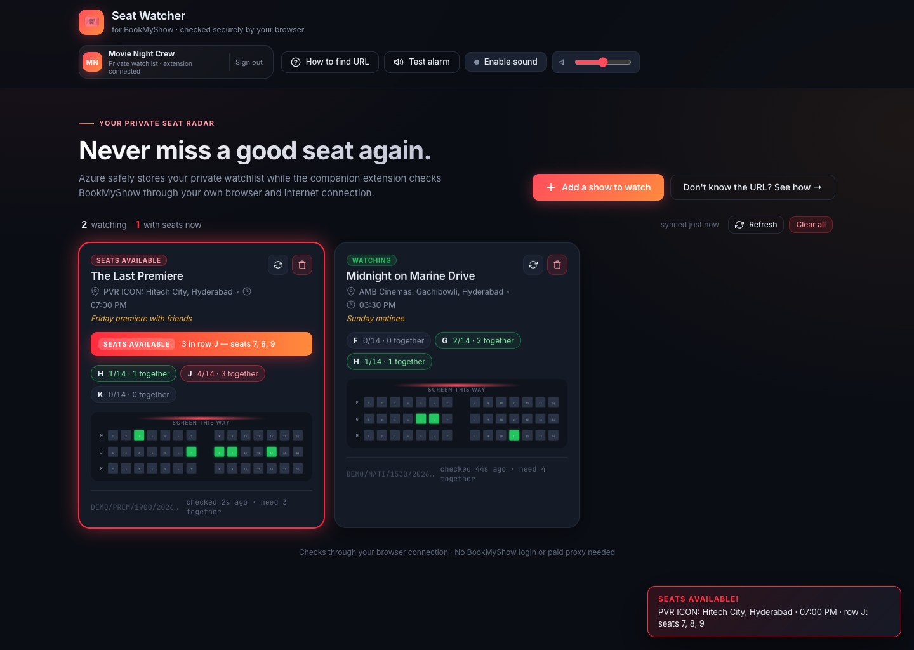
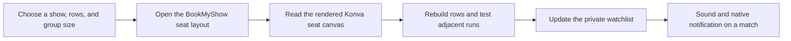
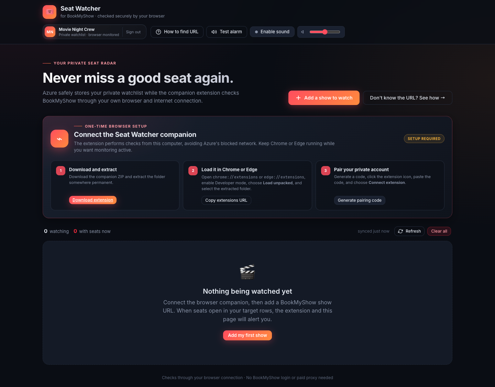
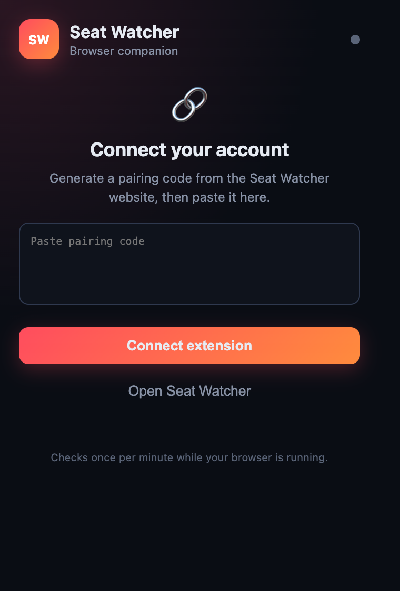

# Seat Watcher

**Stop refreshing BookMyShow. Start watching the seats that actually matter.**

Seat Watcher is a private seat-availability radar for BookMyShow. Give it a
show, the rows you care about, and the number of adjacent seats your group
needs. It keeps checking the live layout, reconstructs the seat map, and alerts
you the moment a matching block appears.

[](https://nodejs.org/)
[](https://www.microsoft.com/edge)
[](https://playwright.dev/)



## Why it exists

The frustrating part of booking a popular show is not finding *a* seat. It is
finding three or four good seats together without spending the evening
refreshing a seat chart.

Seat Watcher turns that repeated manual check into one quiet rule:

> Tell me when at least 3 adjacent seats open in rows H, J, or K.

Until that happens, it stays out of the way. When it does, the watch card lights
up, the live seat map shows exactly where the opening is, and the browser raises
an alert.

## What you get

- **Row-level targeting** - watch only the rows you would genuinely book.
- **Contiguous-seat detection** - distinguish a real group opening from scattered singles.
- **Live visual seat maps** - inspect available and sold seats without decoding a table.
- **Two monitoring modes** - local Playwright checks or a paired Edge/Chrome companion.
- **Private watchlists** - JSON locally, or Azure Cosmos DB with Easy Auth in the cloud.
- **Immediate alerts** - in-page audio plus native browser-extension notifications.
- **No BookMyShow password** - the watcher reads the public seat-layout page.

## How it works



1. **You define the match.** Add a BookMyShow seat-layout URL, row letters, a
   seat count, and whether those seats must be together.
2. **A browser checks the real page.** Locally, Playwright runs headless
   Chromium. In a hosted setup, the Edge/Chrome companion checks through your
   own browser and internet connection.
3. **Seat Watcher reads the canvas model.** BookMyShow renders its map with
   Konva. The checker reads seat rectangles, labels, positions, and colors from
   that scene graph and reconstructs each requested row.
4. **The rule engine looks for a useful opening.** It counts available seats
   and the longest adjacent run. A match updates the dashboard and triggers an
   alert.

The browser companion opens each layout in an inactive background tab, reads
the map, sends only the normalized result back to Seat Watcher, and closes the
tab. It checks once per minute while the browser is running.

## Product tour

### One-time browser setup

The hosted mode guides users through downloading, loading, and privately
pairing the companion extension.



### Companion popup

The popup keeps pairing and manual checks compact. Monitoring continues in the
background after it is connected.

<p align="center">
  
</p>

## Run locally

### Prerequisites

- Node.js 22 or newer
- npm
- Microsoft Edge or Chrome for the optional companion mode

### Start in server-monitoring mode

```bash
git clone https://github.com/madhus1025/SeatWatcher.git
cd SeatWatcher
npm install
npx playwright install chromium
npm start
```

Open [http://localhost:8080](http://localhost:8080). Local watches are saved to
`watches.json`, which is intentionally excluded from Git.

### Add your first watch

1. Open a movie on BookMyShow and choose a theater and showtime.
2. Continue until the URL contains `/seat-layout/`, then copy that URL.
3. In Seat Watcher, choose **Add a show to watch**.
4. Enter rows such as `H, J, K`, the number of seats needed, and whether they
   must be together.
5. Enable sound once if you want the in-page alarm.

## Use the Edge/Chrome companion

The companion is useful for cloud deployments where BookMyShow blocks data
center traffic, and it keeps checks on the user's own connection.

1. Start the app in companion mode:

   ```bash
   SERVER_MONITORING=0 npm start
   ```

2. Download the extension from the setup panel, or use the
   `browser-extension/` directory directly.
3. Open `edge://extensions` or `chrome://extensions`.
4. Enable **Developer mode**, choose **Load unpacked**, and select the extracted
   extension folder.
5. Generate a pairing code in Seat Watcher and paste it into the extension.

Keep Edge or Chrome running while monitoring is active.

## Configuration

| Variable | Default | Purpose |
| --- | --- | --- |
| `PORT` | `8080` | HTTP port |
| `CHECK_INTERVAL` | `15` | Seconds between server-side checks |
| `MAX_CONCURRENT` | `3` | Parallel server-side checks |
| `CHECK_TIMEOUT` | `45000` | Per-check timeout in milliseconds |
| `HEADLESS` | `1` | Set to `0` to show Playwright's browser |
| `DATA_FILE` | `./watches.json` | Local watchlist path |
| `SERVER_MONITORING` | `1` | Set to `0` for companion-only checks |
| `AUTH_REQUIRED` | `0` | Require the hosting platform's authenticated user headers |
| `LOCAL_USER_ID` | `local-user` | User partition used in local development |
| `COSMOS_ENDPOINT` / `COSMOS_KEY` | unset | Enable Cosmos DB persistence when both are set |
| `COSMOS_DATABASE` | `seatwatcher` | Cosmos DB database name |
| `COSMOS_CONTAINER` | `watches` | Cosmos DB container name, partitioned by `userId` |
| `APP_BASE_URL` | hosted app URL | Public URL encoded into extension pairing codes |
| `EXTENSION_TOKEN_SECRET` | random per process | HMAC secret for durable companion pairings |

For a hosted deployment, set a stable `EXTENSION_TOKEN_SECRET`; otherwise
pairing codes stop working after a server restart.

## Deploy

The included `Dockerfile` installs Chromium and runs the Express app on port
`8080`. A production Azure setup normally uses:

- Azure App Service or Container Apps for the web app
- App Service Authentication (Easy Auth) for private user identity
- Cosmos DB for durable, user-partitioned watchlists
- `SERVER_MONITORING=0` so the paired browser performs BookMyShow checks
- A stable `EXTENSION_TOKEN_SECRET` stored as an application secret

The container needs at least 1 GB of memory when server-side Playwright
monitoring is enabled.

## Project map

```text
server.js                 Express API, monitoring loop, auth, and pairing
storage.js                Local JSON and Azure Cosmos DB stores
public/                   Dashboard, live seat maps, alarms, and setup UI
browser-extension/        Manifest V3 Edge/Chrome monitoring companion
scripts/                  Help and README screenshot capture
Dockerfile                Chromium-ready production image
```

## Refresh the screenshots

With the app running on port `8080` and Microsoft Edge installed:

```bash
npm run screenshots
```

The script uses synthetic demo responses, so screenshots never expose a local
watchlist or a real BookMyShow session URL.

## Supported regions

Region cookies are currently mapped for Hyderabad and Visakhapatnam, including
the `hyd`, `hyderabad`, `visa`, `visakhapatnam`, and `vizag` URL slugs. Unknown
slugs fall back to Hyderabad.

## Responsible use

Seat Watcher is an independent utility and is not affiliated with or endorsed
by BookMyShow. Use sensible polling intervals, monitor only shows you intend to
book, and follow the website's terms and local requirements.
